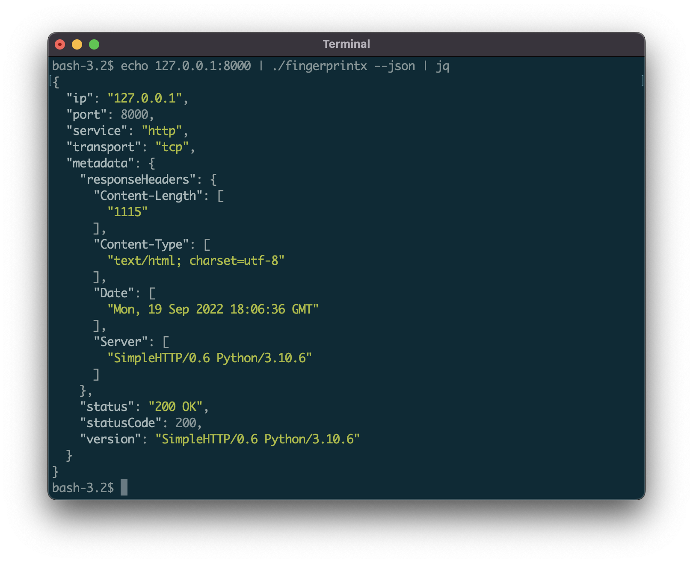
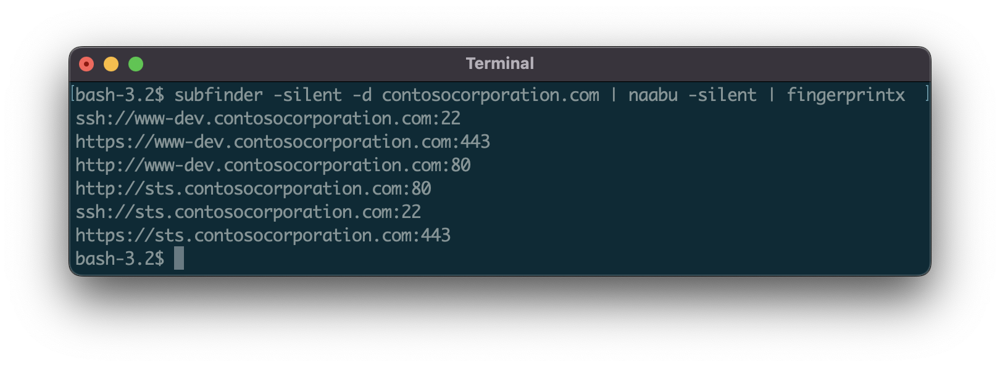
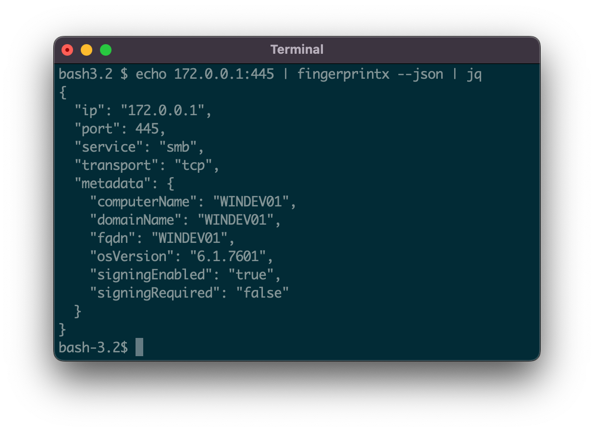

<h1 align="center">
  
  <br>
</h1>

<p align="center">
<a href="https://opensource.org/licenses/Apache-2.0"></a>
<a href="https://github.com/praetorian-inc/fingerprintx/issues"></a>
<a href="https://github.com/praetorian-inc/fingerprintx/releases"></a>
</p>

<p align="center">
  <a href="#features">Features</a> •
  <a href="#installation">Installation</a> •
  <a href="#usage">Usage</a> •
  <a href="#running-fingerprintx">Running fingerprintx</a> •
  <a href="#using-as-a-library">Using as a library</a> •
  <a href="#why-not-nmap">Why not nmap?</a> •
  <a href="#notes">Notes</a> •
  <a href="#acknowledgements">Acknowledgements</a>
</p>

`fingerprintx` is a utility similar to [httpx](https://github.com/projectdiscovery/httpx) that also supports fingerprinting services like as RDP, SSH, MySQL, PostgreSQL, Kafka, etc. `fingerprintx` can be used alongside port scanners like [Naabu](https://github.com/projectdiscovery/naabu) to fingerprint a set of ports identified during a port scan. For example, an engineer may wish to scan an IP range and then rapidly fingerprint the service running on all the discovered ports.

# Features

* Fast fingerprinting of exposed services
* Application layer service discovery
* Plays nicely with other command line tools
* Automatic metadata collection from identified services


https://user-images.githubusercontent.com/69640071/193334167-8405dd50-f9bf-4386-b7b8-83255af41a8b.mov








## Supported Protocols:

<div align="center">

|SERVICE   |TRANSPORT|SERVICE|TRANSPORT|
| ---------| --------| ---------| --------|
|HTTP      |TCP      |REDIS     |TCP      |
|SSH       |TCP      |MQTT3     |TCP      |
|MODBUS    |TCP      |VNC       |TCP      |
|TELNET    |TCP      |MQTT5     |TCP      |
|FTP       |TCP      |RSYNC     |TCP      |
|SMB       |TCP      |RPC       |TCP      |
|DNS       |TCP      |OracleDB  |TCP      |
|SMTP      |TCP      |RTSP      |TCP      |
|PostgreSQL|TCP      |MQTT5     |TCP (TLS)|
|RDP       |TCP      |HTTPS     |TCP (TLS)|
|POP3      |TCP      |SMTPS     |TCP (TLS)|
|KAFKA     |TCP      |MQTT3     |TCP (TLS)|
|MySQL     |TCP      |RDP       |TCP (TLS)|
|MSSQL     |TCP      |POP3S     |TCP (TLS)|
|LDAP      |TCP      |LDAPS     |TCP (TLS)|
|IMAP      |TCP      |IMAPS     |TCP (TLS)|
|SNMP      |UDP      |Kafka     |TCP (TLS)|
|OPENVPN   |UDP      |NETBIOS-NS|UDP      |
|IPSEC     |UDP      |DHCP      |UDP      |
|STUN      |UDP      |NTP       |UDP      |
|DNS       |UDP      |


</div>

# Installation
From Github
```sh
go install github.com/praetorian-inc/fingerprintx/cmd/fingerprintx@latest
```
From source (go version > 1.18)
```sh
$ git clone git@github.com:praetorian-inc/fingerprintx.git
$ cd fingerprintx

# with go version > 1.18
$ go build ./cmd/fingerprintx
$ ./fingerprintx -h
```

Docker
```sh
$ git clone git@github.com:praetorian-inc/fingerprintx.git
$ cd fingerprintx

# build
docker build -t fingerprintx .

# and run it
docker run --rm fingerprintx -h
docker run --rm fingerprintx -t praetorian.com:80 --json
```

# Usage

```sh
fingerprintx -h
```

The `-h` option will display all of the supported flags for `fingerprintx`.

```sh
Usage:
  fingerprintx [flags]
TARGET SPECIFICATION:
	Requires a host and port number or ip and port number. The port is assumed to be open.
	HOST:PORT or IP:PORT
EXAMPLES:
	fingerprintx -t praetorian.com:80
	fingerprintx -l input-file.txt
	fingerprintx --json -t praetorian.com:80,127.0.0.1:8000

Flags:
      --csv               output format in csv
  -f, --fast              fast mode
  -h, --help              help for fingerprintx
      --json              output format in json
  -l, --list string       input file containing targets
  -o, --output string     output file
  -t, --targets strings   target or comma separated target list
  -w, --timeout int       timeout (milliseconds) (default 500)
  -U, --udp               run UDP plugins
  -v, --verbose           verbose mode
```

The `fast` mode will only attempt to fingerprint the default service associated with that port for each target. For example, if `praetorian.com:8443` is the input, only the `https` plugin would be run. If `https` is not running on `praetorian.com:8443`, there will be NO output. Why do this? It's a quick way to fingerprint most of the services in a large list of hosts (think the [80/20 rule](https://en.wikipedia.org/wiki/Pareto_principle)).

# Running Fingerprintx
With one target:
```sh
$ fingerprintx -t 127.0.0.1:8000
http://127.0.0.1:8000
```

By default, the output is in the form: `SERVICE://HOST:PORT`. To get more detailed service output specify JSON with the `--json` flag:
```sh
$ fingerprintx -t 127.0.0.1:8000 --json
{"ip":"127.0.0.1","port":8000,"service":"http","transport":"tcp","metadata":{"responseHeaders":{"Content-Length":["1154"],"Content-Type":["text/html; charset=utf-8"],"Date":["Mon, 19 Sep 2022 18:23:18 GMT"],"Server":["SimpleHTTP/0.6 Python/3.10.6"]},"status":"200 OK","statusCode":200,"version":"SimpleHTTP/0.6 Python/3.10.6"}}
```

Pipe in output from another program (like [naabu](https://github.com/projectdiscovery/naabu)):
```sh
$ naabu 127.0.0.1 -silent 2>/dev/null | fingerprintx
http://127.0.0.1:8000
ftp://127.0.0.1:21
```

Run with an input file:
```
$ cat input.txt | fingerprintx
http://praetorian.com:80
telnet://telehack.com:23

# or if you prefer
$ fingerprintx -l input.txt
http://praetorian.com:80
telnet://telehack.com:23
```
With more metadata output:
```
$ cat input.txt | fingerprintx --json
{"host":"praetorian.com","ip":"146.148.61.165","port":80,"service":"http","transport":"tcp","metadata":{"responseHeaders":{"Connection":["keep-alive"],"Content-Type":["text/html"],"Date":["Mon, 19 Sep 2022 18:37:55 GMT"],"Etag":["W/\"5e3e263f-1703\""],"Keep-Alive":["timeout=20"],"Server":["nginx"],"Vary":["Accept-Encoding"]},"status":"404 Not Found","statusCode":404,"version":"nginx"}}
{"host":"telehack.com","ip":"64.13.139.230","port":23,"service":"telnet","transport":"tcp","metadata":{"serverData":"fffb03"}}
```

# Using as a library
`fingerprintx` can be imported into your project to scan for services on open ports. Example code on how one might do this is provided [here in the examples directory](examples/scan.go). Build with `go build scan.go`. Another file that might be of use as a reference when importing `fingerprintx` into your own project is the [command line runner](pkg/runner/root.go).

# Why Not Nmap?
[Nmap](https://nmap.org/) is the standard for network scanning. Why use `fingerprintx` instead of nmap? The main two reasons are:

* `fingerprintx` works smarter, not harder: the first plugin run against a server with port 8080 open is the http plugin. The default service approach cuts down scanning time in the best case. Most of the time the services running on port 80, 443, 22 are http, https, and ssh -- so that's what `fingerprintx` checks first.
* `fingerprintx` supports json output with the `--json` flag. Nmap supports numerous output options (normal, xml, grep), but they are often hard to parse and script appropriately. `fingerprintx` supports json output which eases integration with other tools in processing pipelines.


# Notes
* Why do you have a `third_party` folder that imports the Go cryptography libraries?
    * Good question! The `ssh` fingerprinting module identifies the various cryptographic options supported by the server when collecting metadata during the handshake process. This makes use of a few unexported functions, which is why the Go cryptography libraries are included here with an [export.go file](third_party/cryptolib/ssh/export.go).
* Fingerprintx is not designed to identify open ports on the target systems and assumes that every `target:port` input is open. If none of the ports are open there will be no output as there are no services running on the targets.
* How does this compare to [zgrab2](https://github.com/zmap/zgrab2)?
    * The `zgrab2` command line usage (and use case) is slightly different than `fingerprintx`. For `zgrab2`, the protocol must be specified ahead of time: `echo praetorian.com | zgrab2 http -p 8000`, which assumes you already know what is running there. For `fingerprintx`, that is not the case: `echo praetorian.com:8000 | fingerprintx`. The "application layer" protocol scanning approach is very similar.

# Acknowledgements
`fingerprintx` is the work of a lot of people, including our great intern class of 2022. Here is a list of contributors so far:

* [praetorian-sohamroy](https://github.com/praetorian-sohamroy)
* [jue-huang](https://github.com/jue-huang)
* [henryjung64](https://github.com/henryjung64)
* [qwetboy10](https://github.com/qwetboy10)
* [jwhenry28](https://github.com/jwhenry28)
* [noahtutt](https://github.com/noahtutt)
